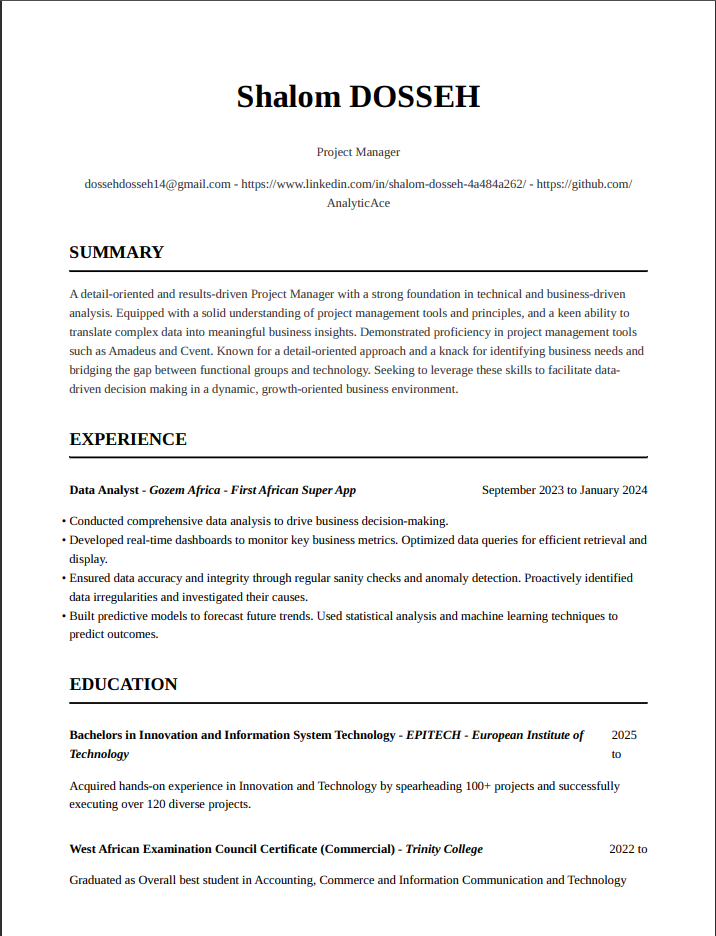

# MyResumo
[](https://forthebadge.com)
[](https://forthebadge.com)
[](https://forthebadge.com)
## Overview
**MyResumo** is an AI-backed resume generator designed to tailor your resume and skills based on a given job description. This innovative tool leverages the latest advancements in AI technology to provide you with a customized resume that stands out.

## Features
- **AI-Powered Customization**: Utilizes AI to analyze job descriptions and tailor your resume accordingly.
- **Streamlit Integration**: Built with Streamlit for a seamless user experience.
- **OctoAI API**: Incorporates OctoAI API for intelligent interactions and suggestions with the use of the model `Mixtral-8x22b-Instruct` which is the first open source model ever to reach GPT-4 quality on MT Bench. It has a context lenght of over `65,536 tokens`

## Technologies Used
- Python
- HTML
- CSS
- Streamlit
- OctoAI API

## Python Libaries
- `nltk==3.8.1`
- `octoai==1.0.2`
- `opencv_contrib_python==4.8.0.74`
- `pdf2image==1.16.3`
- `PyPDF2==3.0.1`
- `pytesseract==0.3.10`
- `python-dotenv==1.0.1`
- `rake_nltk==1.0.6`
- `Requests==2.31.0`
- `streamlit==1.34.0`
- `streamlit_lottie==0.0.5`
- `weasyprint==62.1`

## Results
Below are images showing how the app looks like:

- Home Page


- Main Page


Below is a generated Resumes from the model. [See Full Resume](Data/dosseh_shalom_generated.pdf)
<div align="center">
    
</div>

*Note :* Still working on the frontend of the resume generated this might not look great :)

> [!CAUTION]
>
> This app uses LLM models, which may generate unpredictable responses. Always use caution and common sense when following the generated responses. This
> app is in it beta version, there is still alot of room for improvements, issues will be opened in the following days to solve core bugs and fine turne the prompt for better outputs.

## Running the Application

To run **MyResumo**, you'll need to set up your environment and install the necessary dependencies.

### Prerequisites
- Python 3.8 or higher
- pip (Python package installer)

### Installation
1. Clone the repository:
   ```bash
   git clone https://github.com/AnalyticAce/MyResumo.git
   ```

2. Navigate to the project directory:
   ```bash
   cd MyResumo
   ```
3. Install the required packages:
   ```bash
   pip install -r requirements.txt
   ```

### Setting Up Environment Variables
To run our app, first we need to set up our environment variable, we can do this by:

- Get an OctoAI API token by following [these instructions](https://octo.ai/docs/getting-started/how-to-create-octoai-api-token/).
- Create and paste your API token in the file called `.env` in this directory. See an example in the [`.env.example`](.env.example) file.

```bash
OCTO_AI_TOKEN=<your key here>
```

### Running the App
After setting up the environment variables, you can run the app using Streamlit:

```bash
streamlit run streamlit_app.py
```
If successfully executed the message below should show up
```bash
└─$ streamlit run streamlit_app.py

  You can now view your Streamlit app in your browser.

  Local URL: http://localhost:8501
  Network URL: http://10.50.5.194:8501
```
This will start the Streamlit server, and you should be able to access **MyResumo** at `http://localhost:8501` in your web browser.

## Contribution Guidelines

We welcome contributions to MyResumo! If you'd like to contribute, please follow these guidelines:

1. **Fork the Repository**: Start by forking the MyResumo repository on GitHub.

2. **Clone the Forked Repository**: Clone your forked repository to your local machine using `git clone`.

3. **Create a New Branch**: Create a new branch for your contribution using `git checkout -b feature/my-contribution`.

4. **Make Changes**: Make your desired changes to the codebase. You can add new features, fix bugs, or improve existing functionality.

5. **Test Locally**: Test your changes locally by running the app using streamlit (`streamlit run streamlit_app.py`). Ensure that everything works as expected.

6. **Commit and Push**: Commit your changes and push them to your forked repository.

7. **Create a Pull Request**: Create a pull request from your branch to the `main` branch of the original repository. Provide a clear description of your changes.

8. **Review and Merge**: The maintainers will review your pull request. Once approved, your changes will be merged into the main codebase.

## Contact
For any inquiries or collaboration requests, please reach out to [DOSSEH Shalom](www.linkedin.com/in/shalom-dosseh-4a484a262) at LinkedIn.